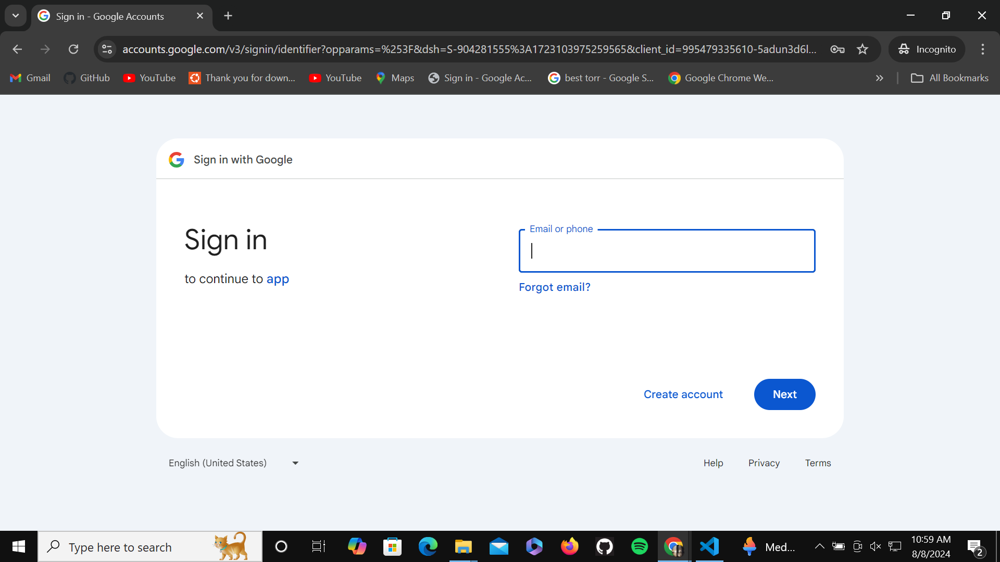
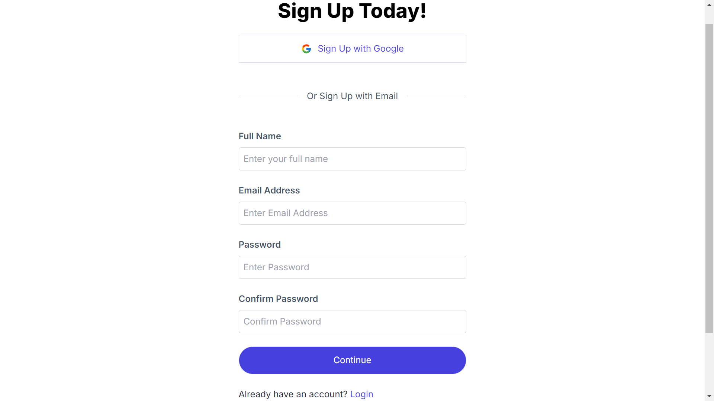
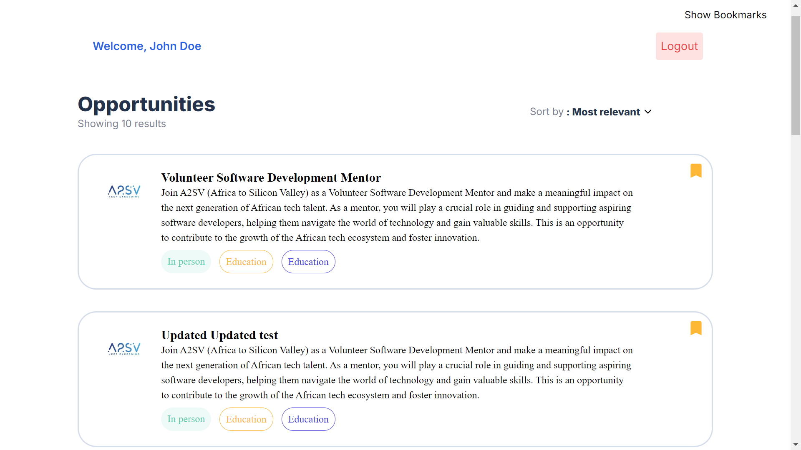
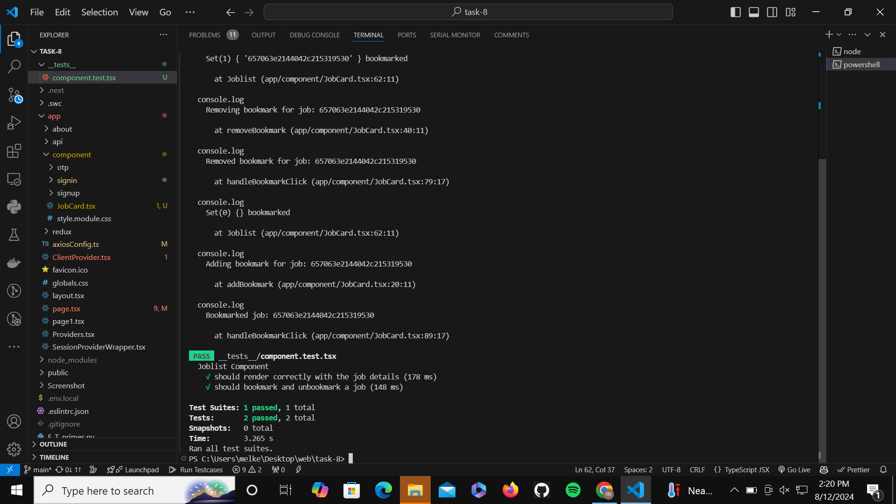

# Job Listing Application

## Overview

This is a job listing application built using Next.js and Tailwind CSS. It includes a job card component populated with dummy data and an avatar image, as well as an applicants dashboard. Additionally, it now supports login and registration with Google, OTP verification, and enhanced bookmark functionality.

## Features

- **Job Card Component**: A visually appealing card with layout, colors, and typography based on the provided UI reference.
- **Dummy Data**: Populated fields such as name, title, and description using static JSON data.
- **Avatar Image**: Incorporated avatar images from a given URL.
- **Applicants Dashboard**: Description of jobs styled using Tailwind CSS.
- **Google Login and Registration**: Users can log in and register using their Google accounts.
- **OTP Verification**: Added OTP verification for enhanced security.
- **Bookmark Functionality**: Users can bookmark or unbookmark job positions. This feature is restricted to authenticated users only and includes a toggle button for easy access.

## Screenshots

- **Home Page**:
  
  *Displays the main job listing page with bookmarked jobs highlighted.*

- **Login Page**:
  
  *Shows the login form for user authentication.*

- **Google Login**:
  
  *Illustrates the Google login option.*

- **OTP Verification**:
  
  *Displays the OTP verification screen.*

- **Page Details**:
  
  *Provides details of individual job positions.*

- **Details**:
  
  *Shows additional details for a specific job.*

- **Sign In**:
  
  *Displays the sign-in page for users.*

- **Bookmark Page**:
  
  *Shows the bookmarked jobs page where users can view their saved jobs.*

- **Cypress Test**:
  
  *Displays an example of Cypress test results for bookmark functionality.*

- **Test1**:
  
  *Illustrates a specific test case or result relevant to the application.*

## Installation

1. Clone the repository:
    ```sh
    git clone https://github.com/melkemk/todo-list-app
    cd task-8
    ```

2. Install dependencies:
    ```sh
    npm install
    ```

## Usage

1. Start the development server:
    ```sh
    npm run dev
    ```

2. Open your browser and navigate to `http://localhost:3000`.