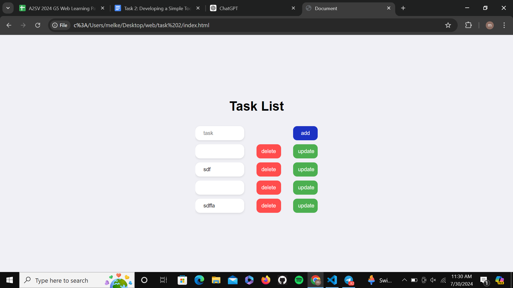

# Simple Todo List App

This is a simple Todo List application built with HTML, CSS, and JavaScript. It allows users to add, edit, and delete tasks.

## Features

- **Add Tasks**: Easily add new tasks to your list.
- **Edit Tasks**: Modify existing tasks with a simple click.
- **Delete Tasks**: Remove tasks when they are completed or no longer needed.
- **Stores in local storage**
## Installation

1. Clone the repository:
   ```bash
   git clone https://github.com/melkemk/todo-list-app.git

