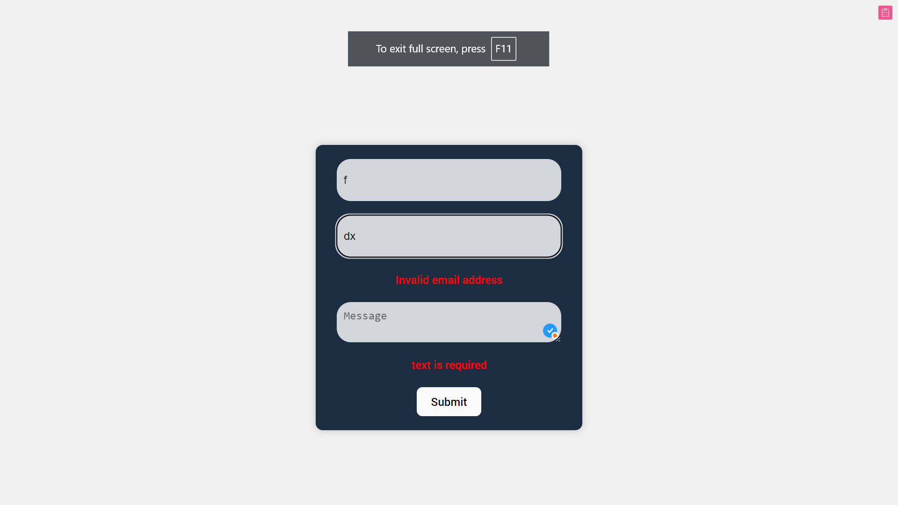

This project is a simple contact form built using React and the `react-hook-form` library. The form includes fields for name, email, and message, with validation rules for each.

1. Clone the repository:
   ```bash
   git clone https://github.com/melkemk/todo-list-app.git



