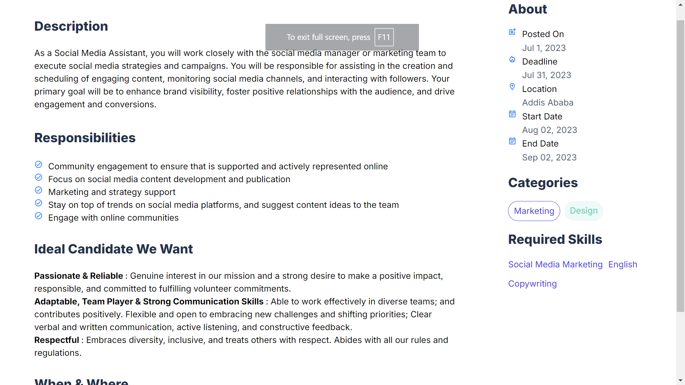
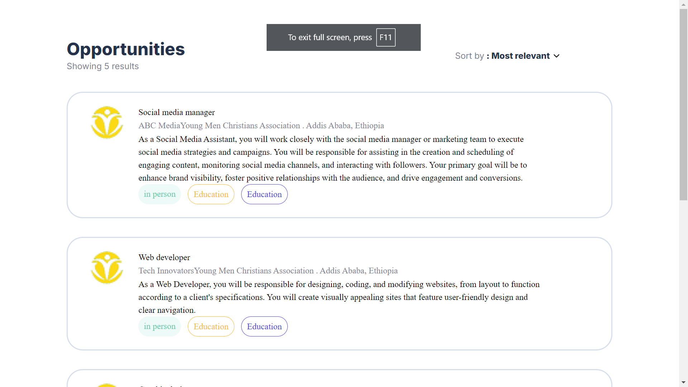

# Job Listing Application

## Overview

This is a job listing application built using Next.js and Tailwind CSS. It includes a job card component populated with dummy data and an avatar image, as well as an applicants dashboard.

## Features

- **Job Card Component**: A visually appealing card with layout, colors, and typography based on the provided UI reference.
- **Dummy Data**: Populated fields such as name, title, and description using static JSON data.
- **Avatar Image**: Incorporated avatar images from a given URL.
- **Applicants Dashboard**: Description of jobs styled using Tailwind CSS.

## Installation

1. Clone the repository:
    ```sh
    git clone https://github.com/melkemk/todo-list-app
    cd task-6
    ```

2. Install dependencies:
    ```sh
    npm install
    ```

3. Run the development server:
    ```sh
    npm run dev
    ```

## Usage

1. Open your browser and navigate to `http://localhost:3000`.
2. Browse through the job listings and view the applicants' dashboard.

## File Structure

- `components/Card.js`: The card component.
- `pages/index.js`: Main page displaying job listings.
- `styles/globals.css`: Global styles using Tailwind CSS.
- `public/avatars`: Avatar images.

## Screenshots

### Job Card Component


### Applicants Dashboard


## Contributing

If you have any suggestions or improvements, feel free to open a pull request or issue.

## License

This project is licensed under the MIT License.
