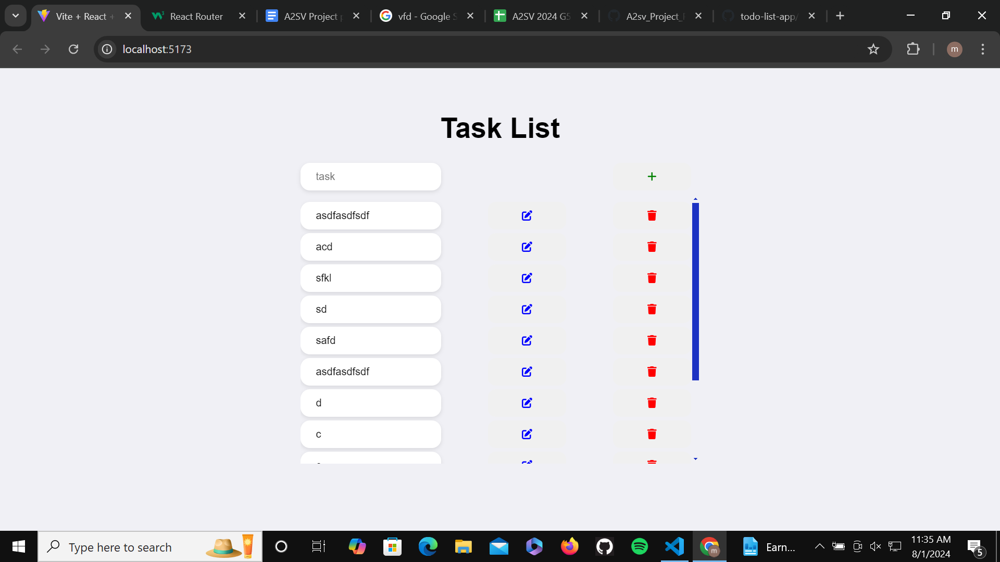

# Simple Todo List App in React

This is a simple Todo List application built with React. It allows users to add, edit, and delete tasks, and stores the tasks in local storage.

## Features

- **Add Tasks**: Easily add new tasks to your list.
- **Edit Tasks**: Modify existing tasks with a simple click.
- **Delete Tasks**: Remove tasks when they are completed or no longer needed.
- **Local Storage**: Tasks are stored in the browser's local storage.

## Installation

1. Clone the repository:
   git clone https://github.com/melkemk/todo-list-app.git
Navigate to the project directory:
cd task_4

install dependencies: 
npm install

Start the development server:
npm run dev

